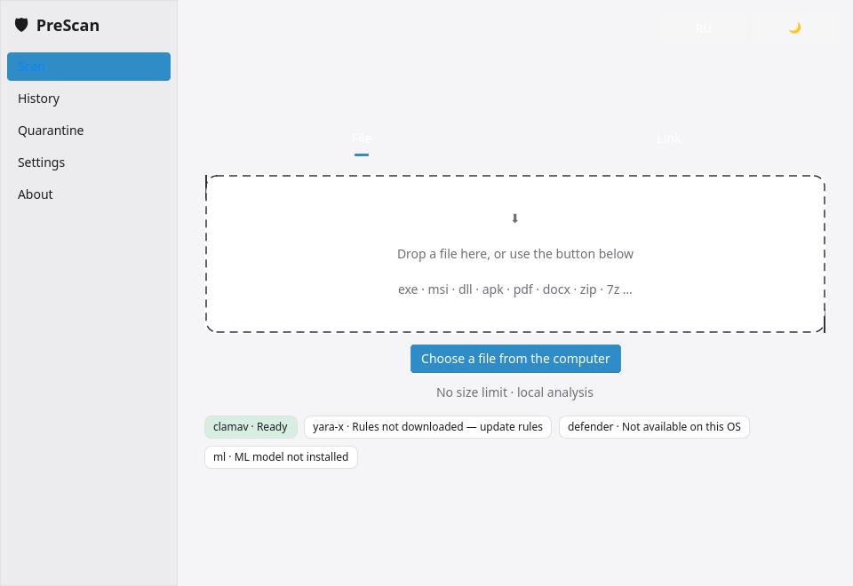
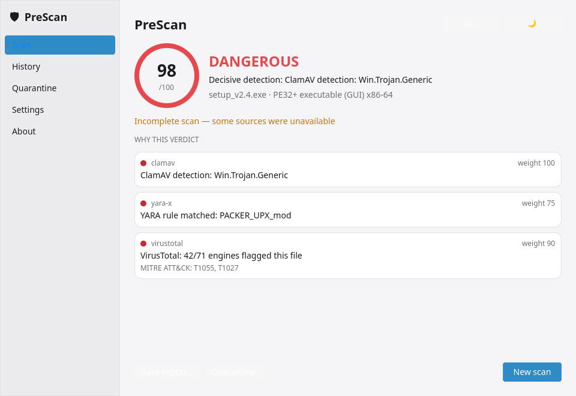
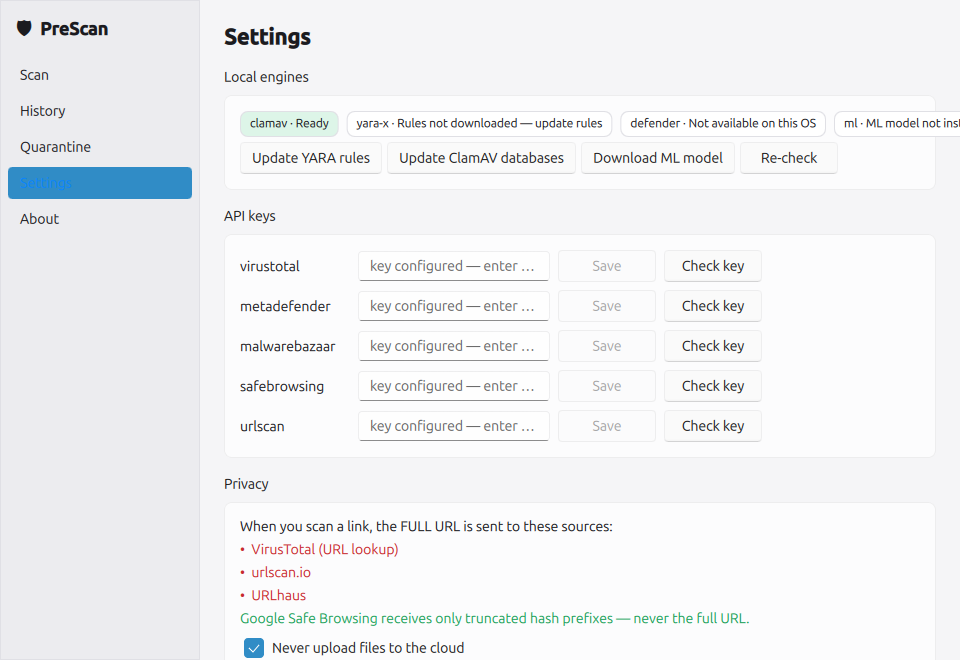
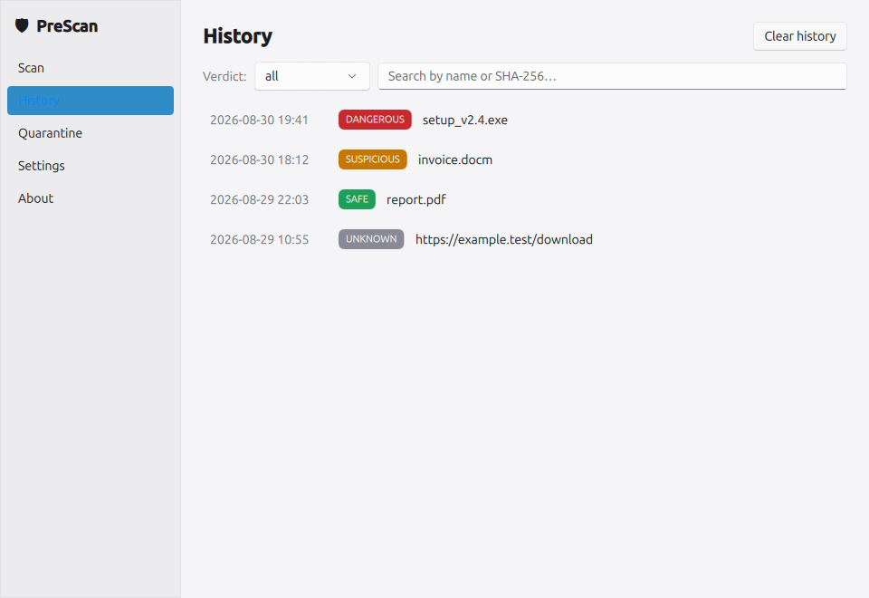
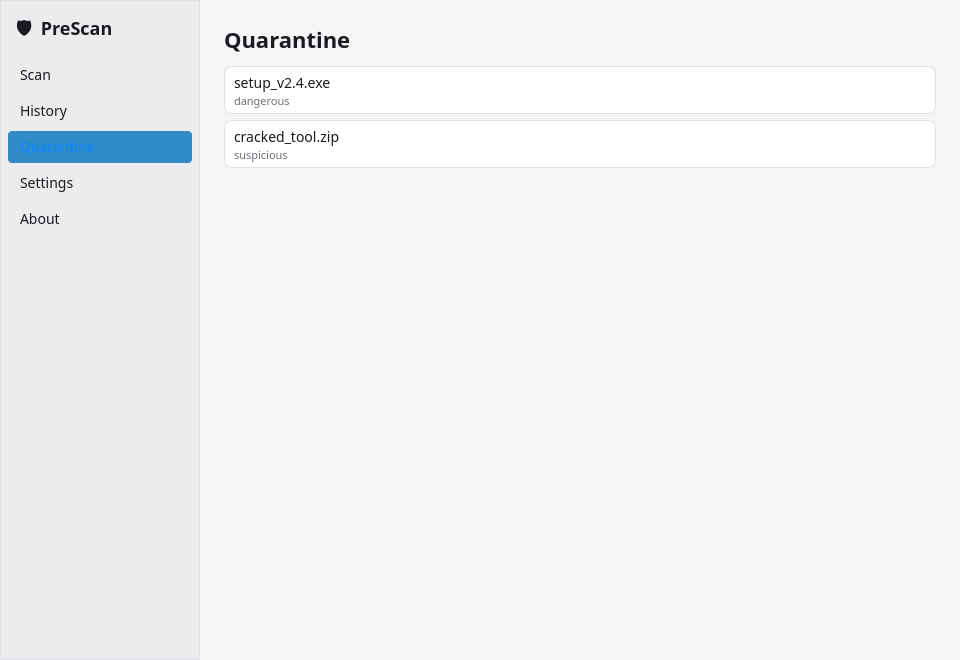
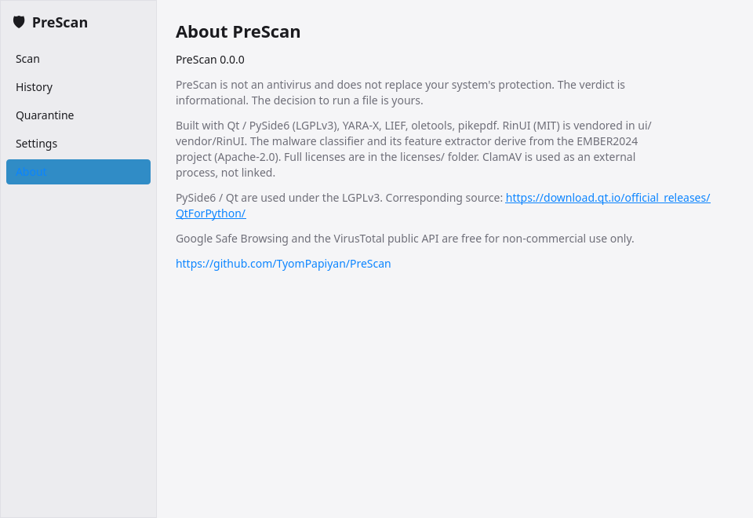

<div align="center">


# 🛡️ PreScan

**A desktop scanner that checks a file for malware _before you run it_ and inspects a
web link _before you download it_ — a local + cloud signal aggregator with an ML
second opinion, not a resident antivirus.**

[](https://github.com/TyomPapiyan/PreScan/actions/workflows/ci.yml)
[](LICENSE)
[](https://www.python.org/)

</div>

---

PreScan turns "should I open this?" into an answer you can read before you act. Point it
at a **file** and it aggregates local engines, optional cloud reputation, and an ML score
into a single verdict — `SAFE · SUSPICIOUS · DANGEROUS · UNKNOWN` — with the signals that
produced it. Point it at a **link** and it inspects the destination (redirects, TLS, RDAP,
heuristics, reputation) before a single byte reaches your Downloads folder. It runs on
**Windows and Linux**, as a desktop GUI (Fluent / WinUI 3) and a first-class CLI, in
**English or Russian**.

> ⚠️ **PreScan is not an antivirus and does not replace your system's built-in protection.**
> Verdicts are **informational**. The decision to run a file is **yours**, and so is the
> responsibility for running it. By design PreScan **never executes** the file it inspects —
> it only reads and parses it as data.

## 📸 Screenshots

Light and dark variants of every screen live in [`docs/screenshots/`](docs/screenshots/).

| Scan | Result | Settings |
|---|---|---|
|  |  |  |

| History | Quarantine | About |
|---|---|---|
|  |  |  |

## ✨ Features

### 🧬 Local engines (offline, no key required)
- **ClamAV** — streamed to the `clamd` daemon over its socket (optional; see below).
- **YARA-X** — signature matching against the YARA Forge ruleset you fetch with `update-rules`.
- **Microsoft Defender** — invoked via `MpCmdRun.exe` on Windows; reported unsupported and
  skipped on Linux.
- **Static PE / ELF** — headers, sections, imports and Authenticode presence parsed with LIEF.
- **Documents** — VBA macros in Office files (oletools) and PDF structure (pikepdf).
- **File identity & hashing** — real type detection (puremagic), extension-mismatch checks,
  MD5 / SHA-1 / SHA-256, imphash, and fuzzy CTPH (`ppdeep`).

### 🧠 ML second opinion
- A LightGBM classifier converted to **ONNX** scores the file from **EMBER2024 feature-version-3**
  vectors computed on `pefile` — the runtime uses only `onnxruntime`, `numpy` and `pefile`.
- The model (`model.onnx`) is **not** bundled; you install it once (see *[The ML model](#-the-ml-model)*).
  Until then the ML stage degrades gracefully and the file scan returns `UNKNOWN` rather than a
  guess.

### 🌐 Cloud reputation & link analysis (optional, key-gated)
- Reputation and detonation lookups: **VirusTotal**, **MetaDefender**, **MalwareBazaar**,
  **ThreatFox**, **URLhaus**, **urlscan**.
- **Google Safe Browsing** via the **hash-prefix** mechanism — the full URL is never sent.
- Every source is off until you add its key, and nothing leaves your machine on a scan run
  with `--no-network`.

### 🔗 Link inspection before download
- URL normalization, redirect chain, TLS certificate and **RDAP** domain age, plus lexical
  heuristics — combined with the reputation sources above into one verdict, before the body is
  fetched. `--download` opts in to fetching and scanning the response body as a file.

### 🧾 Verdicts, quarantine & reports
- A verdict with a `risk_score` and the ranked signals behind it.
- **Quarantine** a dangerous file into an AES-encrypted zip (password `infected`), then
  `list` / `restore` / `purge` it.
- **History** of past scans, and reports exported as **JSON** or **HTML** (PDF from the GUI).

### 🧩 Everything else
- **Bilingual** 🇷🇺 / 🇬🇧 GUI, switchable at runtime.
- **API keys in the OS keyring** — never in the repo, config, logs or reports.
- **No telemetry** — only what a scan explicitly needs leaves the machine, and you can see
  which source receives what on the Privacy screen.

## 🛠️ Tech stack

| Area | Technology |
|---|---|
| Language | Python 3.12+ (3.12 / 3.13) |
| Desktop GUI | [PySide6](https://doc.qt.io/qtforpython/) (Qt Quick / QML) · RinUI (Fluent / WinUI 3, vendored) · [qasync](https://github.com/CabbageDevelopment/qasync) |
| CLI | [Typer](https://typer.tiangolo.com/) |
| Signatures | [YARA-X](https://virustotal.github.io/yara-x/) |
| AV engines | ClamAV via `clamd` (own async client) · Microsoft Defender (`MpCmdRun.exe`, Windows) |
| Static analysis | [LIEF](https://lief.re/) (PE / ELF) · [oletools](https://github.com/decalage2/oletools) (VBA) · [pikepdf](https://pikepdf.readthedocs.io/) (PDF) |
| File & hashing | [puremagic](https://github.com/cdgriffith/puremagic) · [ppdeep](https://github.com/elceef/ppdeep) (CTPH) · [py7zr](https://py7zr.readthedocs.io/) |
| ML runtime | [ONNX Runtime](https://onnxruntime.ai/) · NumPy · [pefile](https://github.com/erocarrera/pefile) (EMBER2024 features) |
| Cloud & URL | [httpx](https://www.python-httpx.org/) · [tenacity](https://tenacity.readthedocs.io/) — VirusTotal, MetaDefender, MalwareBazaar, ThreatFox, URLhaus, Safe Browsing, urlscan |
| Quarantine | [pyzipper](https://github.com/danifus/pyzipper) (AES-zip) |
| Database | [SQLAlchemy 2.0](https://www.sqlalchemy.org/) async + SQLite |
| Config & secrets | [pydantic](https://docs.pydantic.dev/) · [keyring](https://github.com/jaraco/keyring) |
| Logging | [structlog](https://www.structlog.org/) (JSON in prod, colored in dev) |
| Reports | [Jinja2](https://jinja.palletsprojects.com/) (HTML) · Qt `QPdfWriter` (PDF) |
| Packaging | [PyInstaller](https://pyinstaller.org/) `--onedir` → `.deb` · AppImage · Inno Setup |
| Quality | ruff · mypy · pytest · respx · GitHub Actions CI |

## 💻 Supported platforms

- **Linux** — x86_64, **Ubuntu 24.04 or newer**.
- **Windows** — **10 / 11, x64**.
- **ARM is not supported.**

## 📦 Install

### From a release (recommended)

Download the build for your OS from the
[**Releases**](https://github.com/TyomPapiyan/PreScan/releases) page. The `v0.1.0` release
carries three packages plus a checksum file:

| File | Platform |
|---|---|
| `prescan_0.1.0_amd64.deb` | Ubuntu / Debian |
| `PreScan-0.1.0-x86_64.AppImage` | Any Linux x86_64 |
| `PreScan-Setup-0.1.0.exe` | Windows |
| `SHA256SUMS` | verify your download |

**Ubuntu / Debian — the `.deb` (recommended):** apt resolves the runtime libraries itself.
```bash
sudo apt install ./prescan_0.1.0_amd64.deb
prescan            # GUI    |    prescan scan <file|url>    # CLI
```

**Ubuntu — the portable AppImage:** an AppImage declares **no** dependencies, so unlike the
`.deb` it does *not* pull anything in. The Qt GUI needs your system's GL / GLib libraries to
already be present — on a normal desktop they are; on a minimal or server install they are
not, and a missing one surfaces as an ImportError, not a bug in PreScan:
```bash
sudo apt install libgl1 libegl1 libglib2.0-0 libxkbcommon0 libdbus-1-3
chmod +x PreScan-0.1.0-x86_64.AppImage
./PreScan-0.1.0-x86_64.AppImage
```

**Windows 10 / 11:** run `PreScan-Setup-0.1.0.exe`.

> ⚠️ **The Windows installer is not code-signed.** SmartScreen will show a *"Windows protected
> your PC"* warning — click **More info → Run anyway**. Verify the download first (below).

**Verify your download** — the three files' hashes are in `SHA256SUMS` (bare filenames, so it
works with all four files in one folder):
```bash
sha256sum -c SHA256SUMS
```

### From source (development)

```bash
uv venv --python 3.12 .venv
source .venv/bin/activate           # Windows: .venv\Scripts\activate
uv pip install -e '.[core,ui,dev]'
git config core.hooksPath scripts/hooks   # enable the pre-push checklist (once)
scripts/check.sh                          # ruff · ruff format · mypy ×2 · pytest
```

Launch the GUI with `python -m prescan`; the CLI is the `prescan` command. Add a desktop
launcher + shield icon for the current user (no sudo) with
`packaging/install-desktop-entry.sh`.

## 🧪 Installing ClamAV

ClamAV is an **optional** engine — PreScan degrades gracefully if it is absent. Its binaries
are **not** bundled (GPL-2.0). Install it from the official distribution:
<https://www.clamav.net/downloads>.

- **Linux (Debian / Ubuntu):**
  ```bash
  sudo apt-get install clamav clamav-daemon
  sudo systemctl enable --now clamav-daemon
  ```
  PreScan talks to `clamd` over its unix socket (default `/var/run/clamav/clamd.ctl`); adjust
  the socket path in Settings if needed.
- **Windows:** install the official ClamAV package, run `freshclam`, then start the `clamd`
  service. PreScan connects to `clamd` over TCP (default `127.0.0.1:3310`).

## 🤖 The ML model

The malware classifier (`model.onnx`) is **not** shipped with the app. Download it once — it
is fetched from a **pinned GitHub Release** and its **SHA-256 is verified** before install:

```bash
prescan update-model
```

There is a matching **Download ML model** button in Settings. Publishing a new app release
does not affect this download: the model lives in its own pinned release, checked by hash.

## 🔑 API keys

The cloud sources are optional and each stays off until you add its key: VirusTotal,
MetaDefender, MalwareBazaar, Google Safe Browsing, and urlscan. Add them in
**Settings → API keys**; keys are stored in the OS **keyring**, never in the repository,
config files, logs or reports. See [`.env.example`](.env.example) for the provider list and
where to obtain each key.

> **Non-commercial note:** the **Google Safe Browsing** and **VirusTotal Public** APIs are
> free for **non-commercial use only**.

## ▶️ Usage

```bash
prescan scan <file|url>     # main command
prescan engines             # local engine status
prescan update-rules        # download / update the local YARA Forge ruleset
prescan update-model        # download the ML classifier (SHA-256 verified)
prescan update-clamav       # refresh ClamAV signatures (freshclam)
prescan history [--limit N]
prescan quarantine list | restore <id> <dest> | purge <id>
prescan version
```

`prescan scan` options: `--json`, `--html <path>`, `--no-network` (local engines only),
`--allow-upload` (permit cloud upload), `--download` (for a URL, fetch and scan the body),
`--refresh` (ignore the cache), `--timeout <s>`, `--quiet`.

Exit codes for `prescan scan`: `0` SAFE · `1` SUSPICIOUS · `2` DANGEROUS · `3` UNKNOWN ·
`4` runtime error.

## 🗂️ Project structure

```
src/prescan/
├── cli.py                    # Typer CLI
├── core/                     # the engine — pure Python, no Qt
│   ├── engines/              # clamav, yara, defender, static_pe, documents, ml, …
│   ├── providers/            # virustotal, metadefender, malwarebazaar, threatfox, …
│   ├── url/                  # normalize, heuristics, rdap, tls, inspector, downloader
│   ├── ml/                   # EMBER2024 feature vector (inference)
│   ├── pipeline.py           # orchestration, progress, cancellation
│   ├── scoring.py            # signals → verdict + risk_score
│   ├── quarantine.py · storage.py · report.py · updater.py · …
├── ui/                       # thin Qt layer (QML, bridge, i18n) — Qt lives only here
└── resources/                # report template, scoring weights, icons

packaging/                    # build-deb.sh, build-appimage.sh, prescan.iss, …
docs/                         # screenshots, release notes, release checklist
tests/                        # unit, engines, providers, integration, ui
```

## 🔒 Privacy

- The inspected file is **never executed** — only read and parsed as data.
- On a `--no-network` run nothing leaves your machine. Otherwise only what a source needs is
  sent, and the Privacy screen shows which URL sources receive the full URL versus a hash
  prefix (Safe Browsing).
- API keys live in the OS keyring; `structlog` is configured to redact key values from logs.

## 🧑‍💻 Development

```bash
ruff check .            # lint
ruff format --check .   # formatting
mypy src/               # strict types (also run with --platform win32)
pytest                  # tests
scripts/check.sh        # everything above, in order — run before every push
```

Cutting a release is scripted end-to-end from CI; the step-by-step is in
[`docs/release-checklist.md`](docs/release-checklist.md).

## 📜 License

Released under the **MIT License** — see [`LICENSE`](LICENSE). The full texts of every
third-party component's license are collected in [`licenses/`](licenses/) and ship inside
**every distribution**, next to the executable.

## 🗺️ Roadmap

Deferred beyond the first release: Downloads-folder monitoring, an Explorer / Nautilus
context-menu entry, checksum verification, batch folder scans, and an optional local analysis
server — **Strelka** (Apache-2.0) or **Assemblyline 4** (MIT) in Docker — that PreScan would
reach over its API for dozens more analyzers.

---

<div align="center">
<sub>Built with Python · PySide6 · YARA-X · LIEF · ONNX Runtime — <b>PreScan · inspect before you run</b><br>
Not an antivirus · verdicts are informational · the decision to run a file is yours.</sub>
</div>
