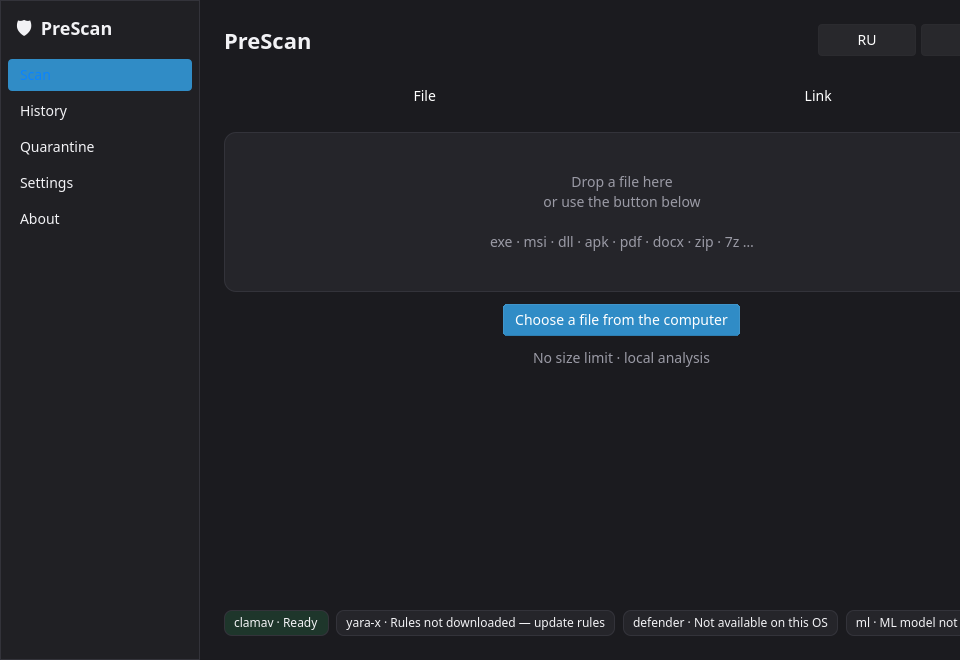
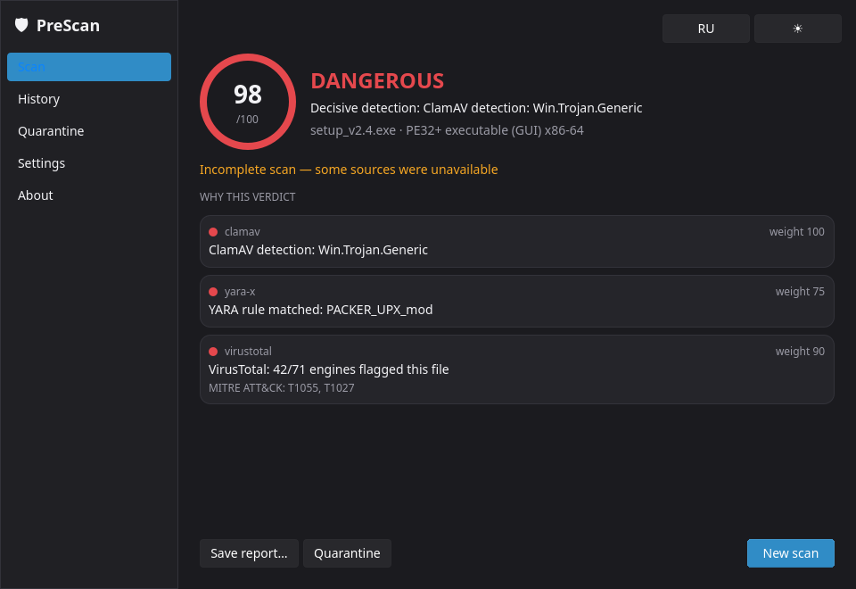
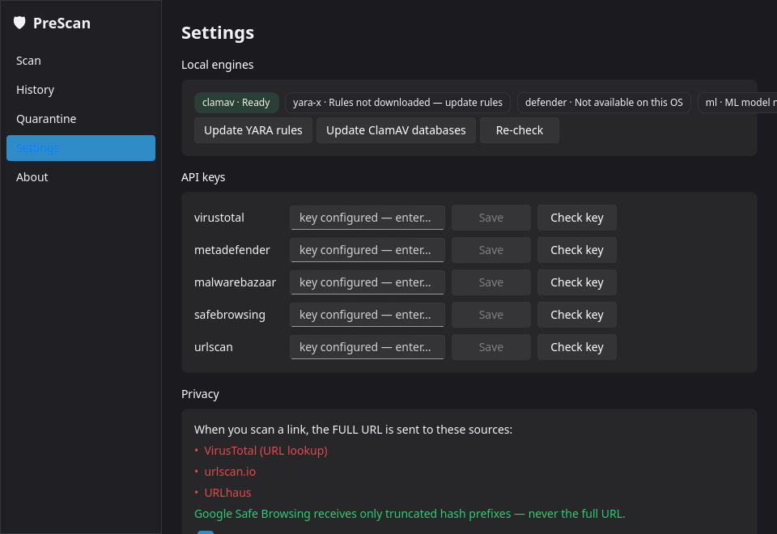

# PreScan

**PreScan** checks a file for malware **before you run it**, and inspects a web
link **before you download it**. It aggregates local and cloud signals and adds an
ML score — a second opinion before execution.

> ⚠️ **PreScan is not an antivirus and does not replace your system's built-in
> protection.** Verdicts are **informational**. The decision to run a file is
> **yours**, and the responsibility for running it is yours. PreScan never executes
> the file it inspects — it only reads and parses it as data.

Windows and Linux. Desktop GUI (Fluent/WinUI 3) plus a first-class CLI.

## Screenshots

In [`docs/screenshots/`](docs/screenshots/) — light and dark themes:

| Scan | Result | Settings |
|---|---|---|
|  |  |  |

History and Quarantine screens are in the same folder.

## Install

- **Release build (recommended):** download the `--onedir` bundle for your OS from
  the project Releases (Linux `.deb`/AppImage, Windows Inno Setup installer) and
  run `prescan`. Qt libraries ship as separate replaceable files next to the
  executable (LGPLv3).
- **From source (development):**
  ```bash
  uv venv --python 3.12 .venv
  source .venv/bin/activate
  uv pip install -e '.[core,ui,dev]'
  git config core.hooksPath scripts/hooks   # enable the pre-push checklist (once)
  scripts/check.sh                          # ruff, ruff format, mypy x2, pytest
  ```
  Launch the GUI with `python -m prescan`; the CLI is the `prescan` command.

  Add a desktop launcher + shield icon for the current user (no sudo):
  ```bash
  packaging/install-desktop-entry.sh
  ```

## Installing ClamAV

ClamAV is an **optional** engine — PreScan degrades gracefully if it is absent.
Binaries are **not** bundled (GPL-2.0). Install it from the official distribution:
<https://www.clamav.net/downloads>.

- **Linux (Debian/Ubuntu):**
  ```bash
  sudo apt-get install clamav clamav-daemon
  sudo systemctl enable --now clamav-daemon
  ```
  PreScan talks to `clamd` over its unix socket (default
  `/var/run/clamav/clamd.ctl`); adjust the socket path in Settings if needed.
- **Windows:** install the official ClamAV package, then run `freshclam` and start
  the `clamd` service. PreScan connects to `clamd` over TCP (default `127.0.0.1:3310`).

Microsoft Defender (`MpCmdRun.exe`) is used automatically on Windows; on Linux the
Defender stage is reported as unsupported and skipped.

## Installing the ML model

The malware classifier (`model.onnx`) is **not** shipped with the app (spec §3.4);
download it once — it is fetched from a GitHub Release and its SHA-256 is verified:

```bash
prescan update-model
```

Until the model is installed the ML stage degrades gracefully (§6.1) and file scans
return `UNKNOWN` instead of an ML-backed verdict. There is a matching **Download ML
model** button in Settings, next to the rule updates.

## CLI

```
prescan scan <file|url>   # main command
prescan engines           # local engine status
prescan update-rules      # download/update YARA Forge + capa rules
prescan update-model      # download the ML classifier (SHA-256 verified)
prescan history
prescan quarantine list|restore|purge
prescan version
```

Exit codes for `prescan scan`: `0` SAFE, `1` SUSPICIOUS, `2` DANGEROUS,
`3` UNKNOWN, `4` runtime error.

## API keys

Some cloud providers need an API key (VirusTotal, MetaDefender, MalwareBazaar,
Google Safe Browsing, urlscan). Add them in **Settings → API keys**; keys are stored
in the OS **keyring**, never in the repository, config files, logs or reports. See
[`.env.example`](.env.example) for the provider list and where to obtain each key.

> **Non-commercial note:** the Google Safe Browsing and VirusTotal **public** APIs
> are free for **non-commercial use only**.

## License

MIT — see [LICENSE](LICENSE). Third-party component licenses are collected in
[`licenses/`](licenses/) (shipped in every distribution) and summarized on the
About screen (spec §11).

## Roadmap

Not in the first release (spec §15): Downloads-folder monitoring, Explorer /
Nautilus context-menu entry, checksum verification, batch folder scans, and an
optional local analysis server — **Strelka** (Apache-2.0) or **Assemblyline 4**
(MIT) in Docker — that PreScan would reach over its API for dozens more analyzers.
